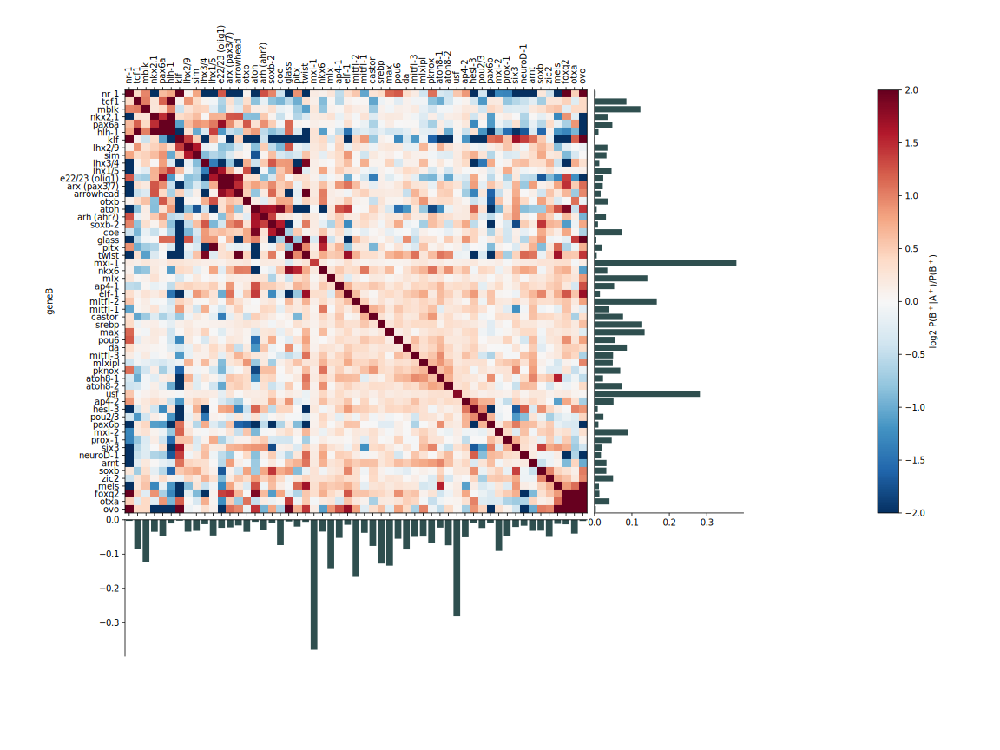
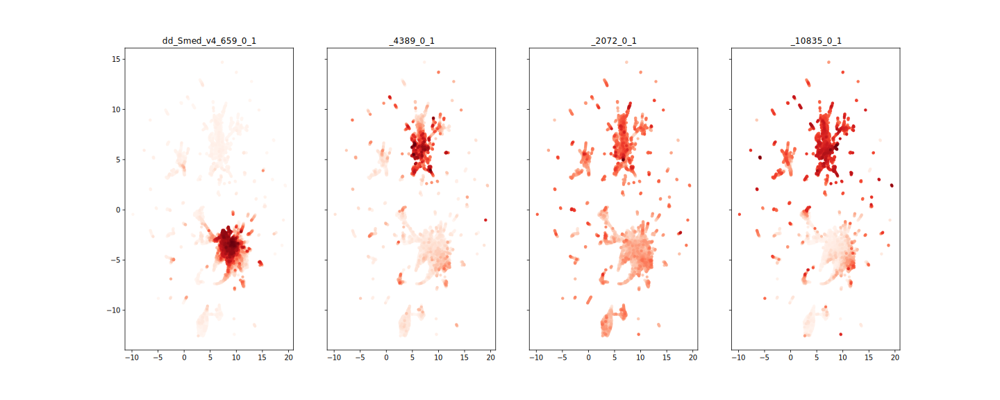
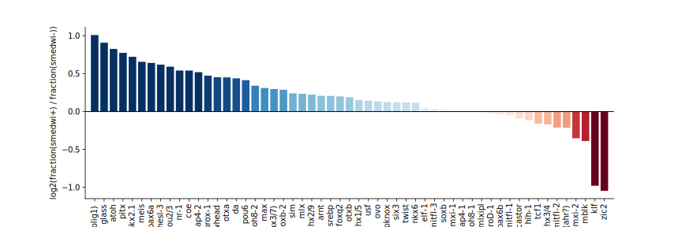

Neural Regeneration Review
========

Code and processed single-cell data for generating the figures used in the upcoming review paper Cellular diversity and plasticity of planarian nervous system (submitted).

**To run:** Download this repository to your local computer. Then follow this link (https://drive.google.com/file/d/1Mae6UVD0_xDjDKGXrW0cLFv9EPxZCIyy/view?usp=sharing) and download the files to the "data" folder in this repository.

Example figures from each file:

**CoExpression_variableSets**

**umap_subset**

**maturationSpecificity**

### Datasets/ References
Homeostatic Cell atlas: https://doi.org/10.1126/science.aaq1736

SAM algorithm: https://github.com/atarashansky/self-assembling-manifold

Regeneration single cell data: https://doi.org/10.1038/s41556-021-00734-6

### Authors

* **Livia Wyss**
* **Samuel Bray**
* **Bo Wang**
